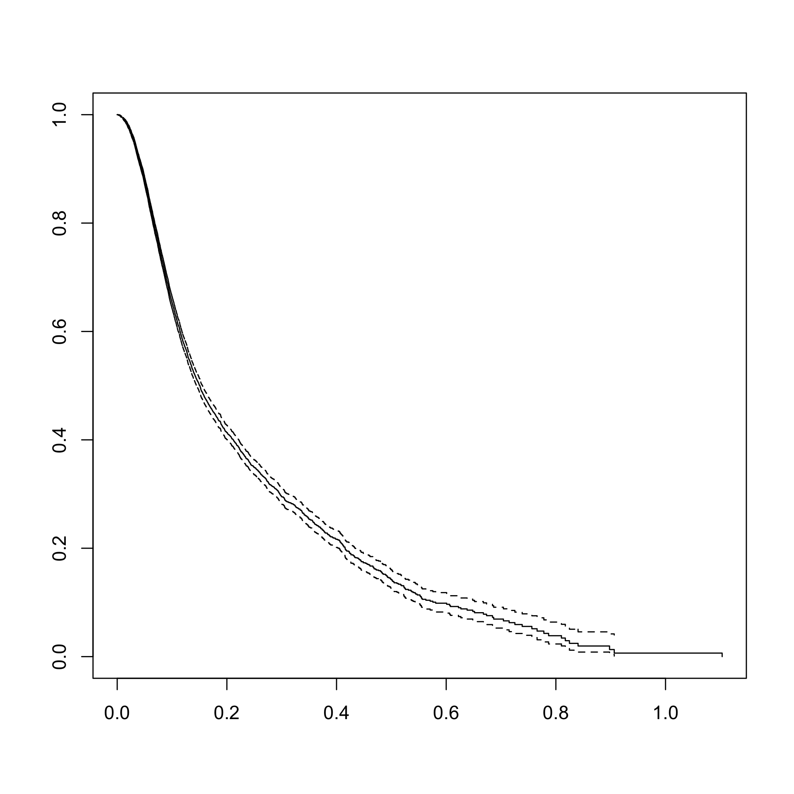
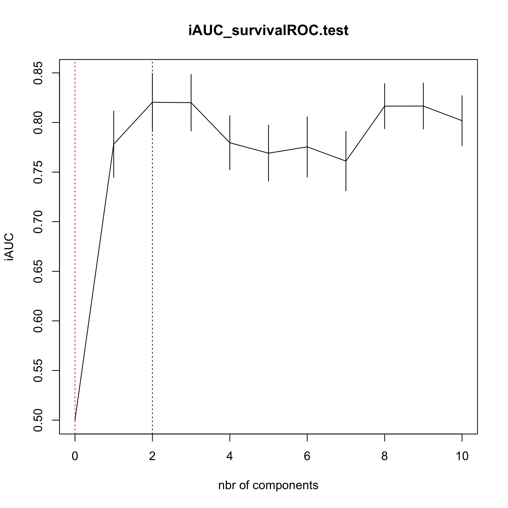
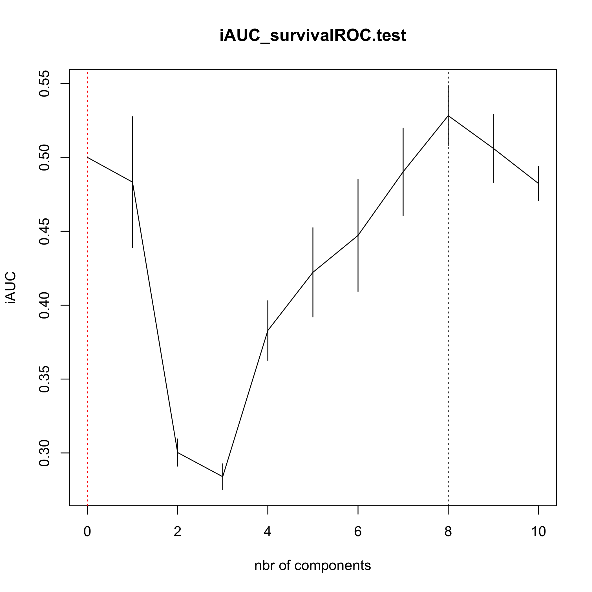

<!-- README.md is generated from README.Rmd. Please edit that file -->


# bigPLScox 

# bigPLScox, PLS models and their extension for big data in R
## Frédéric Bertrand and Myriam Maumy-Bertrand

<!-- badges: start -->
[](https://github.com/fbertran/bigPLScox/actions/workflows/R-CMD-check.yaml)
[](https://github.com/fbertran/bigPLScox/actions/workflows/rhub.yaml)
<!-- badges: end -->


The goal of bigPLScox is provide Cox models in a high dimensional setting in R.


Support for parallel computation and GPU is being developed.


This website and these examples were created by F. Bertrand and M. Maumy-Bertrand.

## Installation

You can install the released version of bigPLScox from [CRAN](https://CRAN.R-project.org) with:


``` r
install.packages("bigPLScox")
```

You can install the development version of bigPLScox from [github](https://github.com) with:


``` r
devtools::install_github("fbertran/bigPLScox")
```

# Example

## Allelotyping real dataset

### The dataset


``` r
library(plsRcox)
data(micro.censure)
Y_train_micro <- micro.censure$survyear[1:80]
C_train_micro <- micro.censure$DC[1:80]
Y_test_micro <- micro.censure$survyear[81:117]
C_test_micro <- micro.censure$DC[81:117]

data(Xmicro.censure_compl_imp)
X_train_micro <- apply((as.matrix(Xmicro.censure_compl_imp)),FUN="as.numeric",MARGIN=2)[1:80,]
X_train_micro_df <- data.frame(X_train_micro)

X_train_micro_orig <- Xmicro.censure_compl_imp[1:80,]
X_train_micro_orig_df <- data.frame(X_train_micro_orig)
```

### Compute deviance residuals with some options.


``` r
computeDR(Y_train_micro,C_train_micro,plot=TRUE)[1:6,1:6]
```

<div class="figure">

<p class="caption">plot of chunk devianceresiduals</p>
</div>

```
#> Error in computeDR(Y_train_micro, C_train_micro, plot = TRUE)[1:6, 1:6]: incorrect number of dimensions
```

## Simulated data

### Generate dataset


``` r
set.seed(4669)
library(bigPLScox)
x_sim <- matrix(sample(0:1, size = 20000, replace = TRUE), ncol = 2)
dCox_sim <- dataCox(10^4, lambda = 3, rho = 2, x_sim,
beta = c(1,3), cens.rate = 5)
```


``` r
data(dCox_sim)
```

### Compute deviance residuals with some options.


``` r
with(dCox_sim,temp<-computeDR(time,status,plot=TRUE))
```

<div class="figure">

<p class="caption">plot of chunk devianceresiduals2</p>
</div>

``` r
rm(temp)
#> Warning in rm(temp): object 'temp' not found
```

### Model Matrix


``` r
coxgpls(~.,Y_train_micro,C_train_micro,ncomp=6,trace=TRUE,model_matrix=TRUE,dataXplan = X_train_micro_orig_df,ind.block.x=c(3,10,20))[1:20,1:6]
#>    D18S61 D17S794 D13S173 D20S107 TP53 D9S171
#> 1       0       0       0       0    1      0
#> 2       0       0       1       1    0      0
#> 3       0       0       0       1    0      1
#> 4       1       1       1       1    1      1
#> 5       1       0       0       1    1      1
#> 6       1       0       0       1    0      1
#> 7       1       0       1       0    1      0
#> 8       1       0       1       1    0      1
#> 9       0       0       0       0    0      0
#> 10      0       0       0       1    1      0
#> 11      0       0       1       1    1      1
#> 12      0       1       1       1    1      1
#> 13      0       1       1       1    0      1
#> 14      1       0       1       1    0      0
#> 15      0       1       0       0    1      1
#> 16      1       0       0       0    0      0
#> 17      0       1       1       0    0      1
#> 18      0       0       0       0    0      1
#> 19      1       1       0       1    1      1
#> 20      1       0       1       0    1      0
```

### coxgpls

``` r
cox_gpls_fit=coxgpls(X_train_micro,Y_train_micro,C_train_micro,ncomp=6,ind.block.x=c(3,10,15))
cox_gpls_fit
#> Call:
#> coxph(formula = YCsurv ~ ., data = tt_gpls)
#> 
#>          coef exp(coef) se(coef)      z      p
#> dim.1 -0.5771    0.5615   0.2266 -2.546 0.0109
#> dim.2 -0.6350    0.5299   0.2798 -2.269 0.0233
#> dim.3 -0.5675    0.5670   0.2358 -2.407 0.0161
#> dim.4  0.2900    1.3365   0.2897  1.001 0.3167
#> dim.5 -0.3797    0.6841   0.2272 -1.671 0.0947
#> dim.6  0.2398    1.2710   0.2790  0.860 0.3899
#> 
#> Likelihood ratio test=26.12  on 6 df, p=0.0002119
#> n= 80, number of events= 17
```


``` r
cox_gpls_fit2=coxgpls(~X_train_micro,Y_train_micro,C_train_micro,ncomp=6,ind.block.x=c(3,10,15))
cox_gpls_fit2
#> Call:
#> coxph(formula = YCsurv ~ ., data = tt_gpls)
#> 
#>          coef exp(coef) se(coef)      z      p
#> dim.1 -0.5771    0.5615   0.2266 -2.546 0.0109
#> dim.2 -0.6350    0.5299   0.2798 -2.269 0.0233
#> dim.3 -0.5675    0.5670   0.2358 -2.407 0.0161
#> dim.4  0.2900    1.3365   0.2897  1.001 0.3167
#> dim.5 -0.3797    0.6841   0.2272 -1.671 0.0947
#> dim.6  0.2398    1.2710   0.2790  0.860 0.3899
#> 
#> Likelihood ratio test=26.12  on 6 df, p=0.0002119
#> n= 80, number of events= 17
```


``` r
cox_gpls_fit3=coxgpls(~.,Y_train_micro,C_train_micro,ncomp=6,
dataXplan=X_train_micro_df,ind.block.x=c(3,10,15))
cox_gpls_fit3
#> Call:
#> coxph(formula = YCsurv ~ ., data = tt_gpls)
#> 
#>          coef exp(coef) se(coef)      z      p
#> dim.1 -0.5771    0.5615   0.2266 -2.546 0.0109
#> dim.2 -0.6350    0.5299   0.2798 -2.269 0.0233
#> dim.3 -0.5675    0.5670   0.2358 -2.407 0.0161
#> dim.4  0.2900    1.3365   0.2897  1.001 0.3167
#> dim.5 -0.3797    0.6841   0.2272 -1.671 0.0947
#> dim.6  0.2398    1.2710   0.2790  0.860 0.3899
#> 
#> Likelihood ratio test=26.12  on 6 df, p=0.0002119
#> n= 80, number of events= 17
```


``` r
rm(cox_gpls_fit,cox_gpls_fit2,cox_gpls_fit3)
```

### cv.coxgpls

``` r
set.seed(123456)
cv.coxgpls.res=cv.coxgpls(list(x=X_train_micro,time=Y_train_micro, status=C_train_micro),nt=10,ind.block.x=c(3,10,15))
#> CV Fold 1
#> CV Fold 2
#> CV Fold 3
#> CV Fold 4
#> CV Fold 5
```

<div class="figure">

<p class="caption">plot of chunk cvcoxgpls</p>
</div>


### coxgplsDR


``` r
cox_gplsDR_fit=coxgplsDR(X_train_micro,Y_train_micro,C_train_micro,ncomp=6,ind.block.x=c(3,10,15))
cox_gplsDR_fit
#> Call:
#> coxph(formula = YCsurv ~ ., data = tt_gplsDR)
#> 
#>         coef exp(coef) se(coef)     z        p
#> dim.1 0.7784    2.1781   0.1987 3.917 8.96e-05
#> dim.2 0.9626    2.6186   0.2982 3.228  0.00125
#> dim.3 0.9110    2.4868   0.4075 2.236  0.02536
#> dim.4 0.9022    2.4650   0.4004 2.253  0.02424
#> dim.5 0.1844    1.2026   0.2664 0.692  0.48865
#> dim.6 0.7448    2.1059   0.4228 1.761  0.07819
#> 
#> Likelihood ratio test=54.95  on 6 df, p=4.745e-10
#> n= 80, number of events= 17
```


``` r
cox_gplsDR_fit2=coxgplsDR(~X_train_micro,Y_train_micro,C_train_micro,ncomp=6,ind.block.x=c(3,10,15))
cox_gplsDR_fit2
#> Call:
#> coxph(formula = YCsurv ~ ., data = tt_gplsDR)
#> 
#>         coef exp(coef) se(coef)     z        p
#> dim.1 0.7784    2.1781   0.1987 3.917 8.96e-05
#> dim.2 0.9626    2.6186   0.2982 3.228  0.00125
#> dim.3 0.9110    2.4868   0.4075 2.236  0.02536
#> dim.4 0.9022    2.4650   0.4004 2.253  0.02424
#> dim.5 0.1844    1.2026   0.2664 0.692  0.48865
#> dim.6 0.7448    2.1059   0.4228 1.761  0.07819
#> 
#> Likelihood ratio test=54.95  on 6 df, p=4.745e-10
#> n= 80, number of events= 17
```


``` r
cox_gplsDR_fit3=coxgplsDR(~.,Y_train_micro,C_train_micro,ncomp=6,
dataXplan=X_train_micro_df,ind.block.x=c(3,10,15))
cox_gplsDR_fit3
#> Call:
#> coxph(formula = YCsurv ~ ., data = tt_gplsDR)
#> 
#>         coef exp(coef) se(coef)     z        p
#> dim.1 0.7784    2.1781   0.1987 3.917 8.96e-05
#> dim.2 0.9626    2.6186   0.2982 3.228  0.00125
#> dim.3 0.9110    2.4868   0.4075 2.236  0.02536
#> dim.4 0.9022    2.4650   0.4004 2.253  0.02424
#> dim.5 0.1844    1.2026   0.2664 0.692  0.48865
#> dim.6 0.7448    2.1059   0.4228 1.761  0.07819
#> 
#> Likelihood ratio test=54.95  on 6 df, p=4.745e-10
#> n= 80, number of events= 17
```


``` r
rm(cox_gplsDR_fit,cox_gplsDR_fit2,cox_gplsDR_fit3)
```

### cv.coxgplsDR


``` r
set.seed(123456)

cv.coxsplsDR.res=cv.coxgplsDR(list(x=X_train_micro,time=Y_train_micro, status=C_train_micro),nt=10,ind.block.x=c(3,10,15))
#> CV Fold 1
#> CV Fold 2
#> CV Fold 3
#> CV Fold 4
#> CV Fold 5
```

<div class="figure">

<p class="caption">plot of chunk cvcoxgplsDR</p>
</div>

``` r
cv.coxsplsDR.res
#> $nt
#> [1] 10
#> 
#> $cv.error10
#>  [1] 0.5000000 0.6786893 0.6913293 0.6485690 0.6656184 0.6591497 0.6733976 0.6252317 0.6388320 0.6592004 0.6589521
#> 
#> $cv.se10
#>  [1] 0.00000000 0.04017423 0.02726346 0.03897730 0.03874068 0.04042522 0.03952962 0.04645295 0.04782038 0.05168926
#> [11] 0.05259748
#> 
#> $folds
#> $folds$`1`
#>  [1] 60  3  2 14 77  6 50  4 72 32 22  1 41 21 63 25
#> 
#> $folds$`2`
#>  [1] 42 67 65 15 73 48 57 26  7 13 31 53  5 27 37 64
#> 
#> $folds$`3`
#>  [1] 71 23 56 35 75 29 30 18 62 44 12 33 68 49 43 55
#> 
#> $folds$`4`
#>  [1] 54 76 24 16 34 66  9 11 69 40 70 36 39  8 19 20
#> 
#> $folds$`5`
#>  [1] 74 38 46 80 47 78 10 45 51 28 61 79 58 17 52 59
#> 
#> 
#> $lambda.min10
#> [1] 2
#> 
#> $lambda.1se10
#> [1] 0
```


### coxDKgplsDR


``` r
cox_DKsplsDR_fit=coxDKgplsDR(X_train_micro,Y_train_micro,C_train_micro,ncomp=6, validation="CV",ind.block.x=c(3,10,15),verbose=TRUE)
#> Kernel :  rbfdot 
#> Estimated_sigma  0.0122308
cox_DKsplsDR_fit
#> Call:
#> coxph(formula = YCsurv ~ ., data = tt_DKgplsDR)
#> 
#>            coef exp(coef)  se(coef)     z       p
#> dim.1 2.902e+00 1.821e+01 1.112e+00 2.609 0.00909
#> dim.2 8.207e+00 3.667e+03 2.637e+00 3.112 0.00186
#> dim.3 5.660e+00 2.871e+02 1.971e+00 2.872 0.00408
#> dim.4 1.607e+01 9.535e+06 5.250e+00 3.061 0.00221
#> dim.5 3.828e+00 4.596e+01 2.040e+00 1.876 0.06062
#> dim.6 1.067e+01 4.288e+04 4.068e+00 2.622 0.00874
#> 
#> Likelihood ratio test=66.76  on 6 df, p=1.88e-12
#> n= 80, number of events= 17
```


``` r
cox_DKsplsDR_fit2=coxDKgplsDR(~X_train_micro,Y_train_micro,C_train_micro,ncomp=6, validation="CV",ind.block.x=c(3,10,15))
cox_DKsplsDR_fit2
#> Call:
#> coxph(formula = YCsurv ~ ., data = tt_DKgplsDR)
#> 
#>            coef exp(coef)  se(coef)     z       p
#> dim.1 2.885e+00 1.790e+01 1.107e+00 2.607 0.00914
#> dim.2 8.022e+00 3.046e+03 2.582e+00 3.106 0.00189
#> dim.3 5.456e+00 2.341e+02 1.896e+00 2.877 0.00401
#> dim.4 1.568e+01 6.460e+06 5.125e+00 3.060 0.00222
#> dim.5 3.757e+00 4.282e+01 2.019e+00 1.860 0.06283
#> dim.6 1.056e+01 3.866e+04 4.077e+00 2.591 0.00958
#> 
#> Likelihood ratio test=66.12  on 6 df, p=2.543e-12
#> n= 80, number of events= 17
```


``` r
cox_DKsplsDR_fit3=coxDKgplsDR(~.,Y_train_micro,C_train_micro,ncomp=6,
validation="CV",dataXplan=data.frame(X_train_micro),ind.block.x=c(3,10,15))
cox_DKsplsDR_fit3
#> Call:
#> coxph(formula = YCsurv ~ ., data = tt_DKgplsDR)
#> 
#>            coef exp(coef)  se(coef)     z       p
#> dim.1 3.043e+00 2.097e+01 1.157e+00 2.630 0.00854
#> dim.2 9.096e+00 8.918e+03 2.926e+00 3.109 0.00188
#> dim.3 6.658e+00 7.792e+02 2.358e+00 2.824 0.00474
#> dim.4 1.772e+01 4.972e+07 5.815e+00 3.047 0.00231
#> dim.5 4.140e+00 6.279e+01 2.134e+00 1.940 0.05240
#> dim.6 1.100e+01 5.989e+04 4.047e+00 2.718 0.00656
#> 
#> Likelihood ratio test=69.44  on 6 df, p=5.327e-13
#> n= 80, number of events= 17
```


``` r
rm(cox_DKsplsDR_fit, cox_DKsplsDR_fit2, cox_DKsplsDR_fit3)
```

### cv.coxDKgPLSDR


``` r
set.seed(123456)

cv.coxDKgplsDR.res=cv.coxDKgplsDR(list(x=X_train_micro,time=Y_train_micro, status=C_train_micro),nt=10,ind.block.x=c(3,10,15))
#> Kernel :  rbfdot 
#> Estimated_sigma  0.01257168
#> CV Fold 1 
#> Kernel :  rbfdot 
#> Estimated_sigma  0.01198263
#> CV Fold 2 
#> Kernel :  rbfdot 
#> Estimated_sigma  0.01156809
#> CV Fold 3 
#> Kernel :  rbfdot 
#> Estimated_sigma  0.01287851
#> CV Fold 4 
#> Kernel :  rbfdot 
#> Estimated_sigma  0.01127231
#> CV Fold 5
```

<div class="figure">

<p class="caption">plot of chunk cvcoxDKgplsDR</p>
</div>

``` r
cv.coxDKgplsDR.res
#> $nt
#> [1] 10
#> 
#> $cv.error10
#>  [1] 0.5000000 0.6381540 0.6963262 0.6537039 0.6204813 0.6886401 0.6632860 0.6349883 0.6762113 0.6261072 0.6087014
#> 
#> $cv.se10
#>  [1] 0.00000000 0.03036225 0.02912723 0.04020941 0.03577022 0.03542745 0.03283778 0.04532447 0.03390654 0.02968504
#> [11] 0.03306444
#> 
#> $folds
#> $folds$`1`
#>  [1] 60  3  2 14 77  6 50  4 72 32 22  1 41 21 63 25
#> 
#> $folds$`2`
#>  [1] 42 67 65 15 73 48 57 26  7 13 31 53  5 27 37 64
#> 
#> $folds$`3`
#>  [1] 71 23 56 35 75 29 30 18 62 44 12 33 68 49 43 55
#> 
#> $folds$`4`
#>  [1] 54 76 24 16 34 66  9 11 69 40 70 36 39  8 19 20
#> 
#> $folds$`5`
#>  [1] 74 38 46 80 47 78 10 45 51 28 61 79 58 17 52 59
#> 
#> 
#> $lambda.min10
#> [1] 2
#> 
#> $lambda.1se10
#> [1] 0
```

### coxsgpls

``` r
cox_sgpls_fit=coxsgpls(X_train_micro,Y_train_micro,C_train_micro,ncomp=6,ind.block.x=c(3,10,15), alpha.x = rep(0.95, 6))
cox_sgpls_fit
#> Call:
#> coxph(formula = YCsurv ~ ., data = tt_sgpls)
#> 
#>          coef exp(coef) se(coef)      z      p
#> dim.1 -0.7429    0.4757   0.2647 -2.807 0.0050
#> dim.2 -0.4003    0.6701   0.2622 -1.527 0.1268
#> dim.3 -0.6329    0.5310   0.2930 -2.160 0.0308
#> dim.4 -0.5733    0.5637   0.2591 -2.213 0.0269
#> dim.5  0.1578    1.1709   0.2375  0.664 0.5064
#> dim.6 -0.2209    0.8018   0.3337 -0.662 0.5079
#> 
#> Likelihood ratio test=21.77  on 6 df, p=0.001331
#> n= 80, number of events= 17
```


``` r
cox_sgpls_fit2=coxsgpls(~X_train_micro,Y_train_micro,C_train_micro,ncomp=6,ind.block.x=c(3,10,15), alpha.x = rep(0.95, 6))
cox_sgpls_fit2
#> Call:
#> coxph(formula = YCsurv ~ ., data = tt_sgpls)
#> 
#>          coef exp(coef) se(coef)      z      p
#> dim.1 -0.7429    0.4757   0.2647 -2.807 0.0050
#> dim.2 -0.4003    0.6701   0.2622 -1.527 0.1268
#> dim.3 -0.6329    0.5310   0.2930 -2.160 0.0308
#> dim.4 -0.5733    0.5637   0.2591 -2.213 0.0269
#> dim.5  0.1578    1.1709   0.2375  0.664 0.5064
#> dim.6 -0.2209    0.8018   0.3337 -0.662 0.5079
#> 
#> Likelihood ratio test=21.77  on 6 df, p=0.001331
#> n= 80, number of events= 17
```


``` r
cox_sgpls_fit3=coxsgpls(~.,Y_train_micro,C_train_micro,ncomp=6,
dataXplan=X_train_micro_df,ind.block.x=c(3,10,15), alpha.x = rep(0.95, 6))
cox_sgpls_fit3
#> Call:
#> coxph(formula = YCsurv ~ ., data = tt_sgpls)
#> 
#>          coef exp(coef) se(coef)      z      p
#> dim.1 -0.7429    0.4757   0.2647 -2.807 0.0050
#> dim.2 -0.4003    0.6701   0.2622 -1.527 0.1268
#> dim.3 -0.6329    0.5310   0.2930 -2.160 0.0308
#> dim.4 -0.5733    0.5637   0.2591 -2.213 0.0269
#> dim.5  0.1578    1.1709   0.2375  0.664 0.5064
#> dim.6 -0.2209    0.8018   0.3337 -0.662 0.5079
#> 
#> Likelihood ratio test=21.77  on 6 df, p=0.001331
#> n= 80, number of events= 17
```


``` r
rm(cox_sgpls_fit,cox_sgpls_fit2,cox_sgpls_fit3)
```

### cv.coxsgpls

``` r
set.seed(123456)
cv.coxsgpls.res=cv.coxsgpls(list(x=X_train_micro,time=Y_train_micro, status=C_train_micro),nt=10,ind.block.x=c(3,10,15), alpha.x = rep(0.95, 10))
#> CV Fold 1
#> CV Fold 2
#> CV Fold 3
#> CV Fold 4
#> CV Fold 5
```

<div class="figure">

<p class="caption">plot of chunk cvcoxsgls</p>
</div>

``` r
cv.coxsgpls.res
#> $nt
#> [1] 10
#> 
#> $cv.error10
#>  [1] 0.5000000 0.4217599 0.5382923 0.5519544 0.5656905 0.6314850 0.5693082 0.5326229 0.5315857 0.5420410 0.5542452
#> 
#> $cv.se10
#>  [1] 0.00000000 0.03195833 0.02746499 0.03490158 0.02550641 0.04067144 0.03223606 0.03644131 0.03369888 0.03727618
#> [11] 0.03369400
#> 
#> $folds
#> $folds$`1`
#>  [1] 60  3  2 14 77  6 50  4 72 32 22  1 41 21 63 25
#> 
#> $folds$`2`
#>  [1] 42 67 65 15 73 48 57 26  7 13 31 53  5 27 37 64
#> 
#> $folds$`3`
#>  [1] 71 23 56 35 75 29 30 18 62 44 12 33 68 49 43 55
#> 
#> $folds$`4`
#>  [1] 54 76 24 16 34 66  9 11 69 40 70 36 39  8 19 20
#> 
#> $folds$`5`
#>  [1] 74 38 46 80 47 78 10 45 51 28 61 79 58 17 52 59
#> 
#> 
#> $lambda.min10
#> [1] 5
#> 
#> $lambda.1se10
#> [1] 0
```

### coxsgplsDR


``` r
cox_sgplsDR_fit=coxsgplsDR(X_train_micro,Y_train_micro,C_train_micro,ncomp=6,ind.block.x=c(3,10,15), alpha.x = rep(0.95, 10))
cox_sgplsDR_fit
#> Call:
#> coxph(formula = YCsurv ~ ., data = tt_sgplsDR)
#> 
#>           coef exp(coef) se(coef)      z        p
#> dim.1  0.85431   2.34976  0.24239  3.525 0.000424
#> dim.2  0.96004   2.61180  0.29938  3.207 0.001342
#> dim.3  1.64702   5.19149  0.69268  2.378 0.017419
#> dim.4  0.23137   1.26033  0.23656  0.978 0.328037
#> dim.5 -0.06767   0.93457  0.30587 -0.221 0.824917
#> dim.6  0.37661   1.45734  0.36468  1.033 0.301734
#> 
#> Likelihood ratio test=53.66  on 6 df, p=8.658e-10
#> n= 80, number of events= 17
```


``` r
cox_sgplsDR_fit2=coxsgplsDR(~X_train_micro,Y_train_micro,C_train_micro,ncomp=6,ind.block.x=c(3,10,15), alpha.x = rep(0.95, 10))
cox_sgplsDR_fit2
#> Call:
#> coxph(formula = YCsurv ~ ., data = tt_sgplsDR)
#> 
#>           coef exp(coef) se(coef)      z        p
#> dim.1  0.85431   2.34976  0.24239  3.525 0.000424
#> dim.2  0.96004   2.61180  0.29938  3.207 0.001342
#> dim.3  1.64702   5.19149  0.69268  2.378 0.017419
#> dim.4  0.23137   1.26033  0.23656  0.978 0.328037
#> dim.5 -0.06767   0.93457  0.30587 -0.221 0.824917
#> dim.6  0.37661   1.45734  0.36468  1.033 0.301734
#> 
#> Likelihood ratio test=53.66  on 6 df, p=8.658e-10
#> n= 80, number of events= 17
```


``` r
cox_sgplsDR_fit3=coxsgplsDR(~.,Y_train_micro,C_train_micro,ncomp=6, dataXplan=X_train_micro_df,ind.block.x=c(3,10,15), alpha.x = rep(0.95, 10))
cox_sgplsDR_fit3
#> Call:
#> coxph(formula = YCsurv ~ ., data = tt_sgplsDR)
#> 
#>           coef exp(coef) se(coef)      z        p
#> dim.1  0.85431   2.34976  0.24239  3.525 0.000424
#> dim.2  0.96004   2.61180  0.29938  3.207 0.001342
#> dim.3  1.64702   5.19149  0.69268  2.378 0.017419
#> dim.4  0.23137   1.26033  0.23656  0.978 0.328037
#> dim.5 -0.06767   0.93457  0.30587 -0.221 0.824917
#> dim.6  0.37661   1.45734  0.36468  1.033 0.301734
#> 
#> Likelihood ratio test=53.66  on 6 df, p=8.658e-10
#> n= 80, number of events= 17
```


``` r
rm(cox_sgplsDR_fit,cox_sgplsDR_fit2,cox_sgplsDR_fit3)
```

### cv.coxsgplsDR


``` r
set.seed(4669)

cv.coxsgplsDR.res=cv.coxsgplsDR(list(x=X_train_micro,time=Y_train_micro, status=C_train_micro),nt=10,ind.block.x=c(3,10,15), alpha.x = rep(0.95, 10))
#> CV Fold 1
#> CV Fold 2
#> CV Fold 3
#> CV Fold 4
#> CV Fold 5
```

<div class="figure">

<p class="caption">plot of chunk cvcoxsgplsDR</p>
</div>


### coxDKsgplsDR


``` r
cox_DKsgplsDR_fit=coxDKsgplsDR(X_train_micro,Y_train_micro,C_train_micro,ncomp=6, validation="CV",ind.block.x=c(3,10,15), alpha.x = rep(0.95, 10),verbose=TRUE)
#> Kernel :  rbfdot 
#> Estimated_sigma  0.01231673
cox_DKsgplsDR_fit
#> Call:
#> coxph(formula = YCsurv ~ ., data = tt_sgplsDR)
#> 
#>           coef exp(coef) se(coef)      z        p
#> dim.1  0.85431   2.34976  0.24239  3.525 0.000424
#> dim.2  0.96004   2.61180  0.29938  3.207 0.001342
#> dim.3  1.64702   5.19149  0.69268  2.378 0.017419
#> dim.4  0.23137   1.26033  0.23656  0.978 0.328037
#> dim.5 -0.06767   0.93457  0.30587 -0.221 0.824917
#> dim.6  0.37661   1.45734  0.36468  1.033 0.301734
#> 
#> Likelihood ratio test=53.66  on 6 df, p=8.658e-10
#> n= 80, number of events= 17
```


``` r
cox_DKsgplsDR_fit2=coxDKsgplsDR(~X_train_micro,Y_train_micro,C_train_micro,ncomp=6, validation="CV",ind.block.x=c(3,10,15), alpha.x = rep(0.95, 10))
cox_DKsgplsDR_fit2
#> Call:
#> coxph(formula = YCsurv ~ ., data = tt_sgplsDR)
#> 
#>           coef exp(coef) se(coef)      z        p
#> dim.1  0.85431   2.34976  0.24239  3.525 0.000424
#> dim.2  0.96004   2.61180  0.29938  3.207 0.001342
#> dim.3  1.64702   5.19149  0.69268  2.378 0.017419
#> dim.4  0.23137   1.26033  0.23656  0.978 0.328037
#> dim.5 -0.06767   0.93457  0.30587 -0.221 0.824917
#> dim.6  0.37661   1.45734  0.36468  1.033 0.301734
#> 
#> Likelihood ratio test=53.66  on 6 df, p=8.658e-10
#> n= 80, number of events= 17
```


``` r
cox_DKsgplsDR_fit3=coxDKsgplsDR(~.,Y_train_micro,C_train_micro,ncomp=6, validation="CV",dataXplan=data.frame(X_train_micro),ind.block.x=c(3,10,15), alpha.x = rep(0.95, 10))
cox_DKsgplsDR_fit3
#> Call:
#> coxph(formula = YCsurv ~ ., data = tt_sgplsDR)
#> 
#>           coef exp(coef) se(coef)      z        p
#> dim.1  0.85431   2.34976  0.24239  3.525 0.000424
#> dim.2  0.96004   2.61180  0.29938  3.207 0.001342
#> dim.3  1.64702   5.19149  0.69268  2.378 0.017419
#> dim.4  0.23137   1.26033  0.23656  0.978 0.328037
#> dim.5 -0.06767   0.93457  0.30587 -0.221 0.824917
#> dim.6  0.37661   1.45734  0.36468  1.033 0.301734
#> 
#> Likelihood ratio test=53.66  on 6 df, p=8.658e-10
#> n= 80, number of events= 17
```


``` r
rm(cox_DKsgplsDR_fit, cox_DKsgplsDR_fit2, cox_DKsgplsDR_fit3)
```

### cv.coxDKgplsDR


``` r
set.seed(123456)

cv.coxDKgplsDR.res=cv.coxDKgplsDR(list(x=X_train_micro,time=Y_train_micro, status=C_train_micro),nt=10,ind.block.x=c(3,10,15), alpha.x = rep(0.95, 10))
#> Kernel :  rbfdot 
#> Estimated_sigma  0.01257168
#> CV Fold 1 
#> Kernel :  rbfdot 
#> Estimated_sigma  0.01198263
#> CV Fold 2 
#> Kernel :  rbfdot 
#> Estimated_sigma  0.01156809
#> CV Fold 3 
#> Kernel :  rbfdot 
#> Estimated_sigma  0.01287851
#> CV Fold 4 
#> Kernel :  rbfdot 
#> Estimated_sigma  0.01127231
#> CV Fold 5
```

<div class="figure">

<p class="caption">plot of chunk cvcoxDKgplsDR2</p>
</div>


### coxspls_sgpls

``` r
cox_coxspls_sgpls_fit=coxspls_sgpls(X_train_micro,Y_train_micro,C_train_micro,ncomp=6,keepX = rep(5, 6))
cox_coxspls_sgpls_fit
#> Call:
#> coxph(formula = YCsurv ~ ., data = tt_spls_sgpls)
#> 
#>           coef exp(coef) se(coef)      z       p
#> dim.1 -0.86093   0.42277  0.31260 -2.754 0.00589
#> dim.2 -0.07828   0.92471  0.29744 -0.263 0.79242
#> dim.3 -0.65945   0.51714  0.30904 -2.134 0.03285
#> dim.4 -0.02423   0.97606  0.32508 -0.075 0.94058
#> dim.5 -0.29968   0.74106  0.30668 -0.977 0.32849
#> dim.6 -0.31284   0.73137  0.24256 -1.290 0.19714
#> 
#> Likelihood ratio test=15.83  on 6 df, p=0.01468
#> n= 80, number of events= 17
```


``` r
cox_coxspls_sgpls_fit2=coxspls_sgpls(~X_train_micro,Y_train_micro,C_train_micro,ncomp=6,ind.keepX = rep(5, 6))
cox_coxspls_sgpls_fit2
#> Call:
#> coxph(formula = YCsurv ~ ., data = tt_spls_sgpls)
#> 
#>            coef exp(coef)  se(coef)      z      p
#> dim.1 -0.295124  0.744439  0.260495 -1.133 0.2572
#> dim.2 -0.652196  0.520901  0.323480 -2.016 0.0438
#> dim.3 -0.445224  0.640681  0.278859 -1.597 0.1104
#> dim.4 -0.069023  0.933305  0.276956 -0.249 0.8032
#> dim.5  0.044924  1.045948  0.275060  0.163 0.8703
#> dim.6 -0.005691  0.994325  0.303281 -0.019 0.9850
#> 
#> Likelihood ratio test=8.81  on 6 df, p=0.1845
#> n= 80, number of events= 17
```


``` r
cox_coxspls_sgpls_fit3=coxspls_sgpls(~.,Y_train_micro,C_train_micro,ncomp=6, dataXplan=X_train_micro_df,keepX = rep(5, 6))
cox_coxspls_sgpls_fit3
#> Call:
#> coxph(formula = YCsurv ~ ., data = tt_spls_sgpls)
#> 
#>           coef exp(coef) se(coef)      z       p
#> dim.1 -0.86093   0.42277  0.31260 -2.754 0.00589
#> dim.2 -0.07828   0.92471  0.29744 -0.263 0.79242
#> dim.3 -0.65945   0.51714  0.30904 -2.134 0.03285
#> dim.4 -0.02423   0.97606  0.32508 -0.075 0.94058
#> dim.5 -0.29968   0.74106  0.30668 -0.977 0.32849
#> dim.6 -0.31284   0.73137  0.24256 -1.290 0.19714
#> 
#> Likelihood ratio test=15.83  on 6 df, p=0.01468
#> n= 80, number of events= 17
```


``` r
rm(cox_coxspls_sgpls_fit, cox_coxspls_sgpls_fit2, cox_coxspls_sgpls_fit3)
```

### cv.coxspls_sgpls

``` r
set.seed(123456)
(cv.coxspls_sgpls.res=cv.coxspls_sgpls(list(x=X_train_micro,time=Y_train_micro, status=C_train_micro),nt=10, keepX = rep(5, 10)))
#> CV Fold 1
#> CV Fold 2
#> CV Fold 3
#> CV Fold 4
#> CV Fold 5
```

<div class="figure">

<p class="caption">plot of chunk cvcoxsplsDR</p>
</div>

```
#> $nt
#> [1] 10
#> 
#> $cv.error10
#>  [1] 0.5000000 0.4832648 0.3002967 0.2839353 0.3828152 0.4222179 0.4471778 0.4902294 0.5282298 0.5060990 0.4823500
#> 
#> $cv.se10
#>  [1] 0.000000000 0.044268528 0.009191356 0.008710989 0.020220150 0.030221867 0.037941448 0.029609116 0.020393025
#> [10] 0.023001067 0.011534037
#> 
#> $folds
#> $folds$`1`
#>  [1] 60  3  2 14 77  6 50  4 72 32 22  1 41 21 63 25
#> 
#> $folds$`2`
#>  [1] 42 67 65 15 73 48 57 26  7 13 31 53  5 27 37 64
#> 
#> $folds$`3`
#>  [1] 71 23 56 35 75 29 30 18 62 44 12 33 68 49 43 55
#> 
#> $folds$`4`
#>  [1] 54 76 24 16 34 66  9 11 69 40 70 36 39  8 19 20
#> 
#> $folds$`5`
#>  [1] 74 38 46 80 47 78 10 45 51 28 61 79 58 17 52 59
#> 
#> 
#> $lambda.min10
#> [1] 8
#> 
#> $lambda.1se10
#> [1] 0
```


### coxspls_sgplsDR


``` r
cox_spls_sgplsDR_fit=coxspls_sgplsDR(X_train_micro,Y_train_micro,C_train_micro,ncomp=6,ind.block.x=c(3,10,15))
#> Error in sPLS(ncomp = 6, ind.block.x = c(3, 10, 15), X = structure(list(: unused argument (ind.block.x = c(3, 10, 15))
```


``` r
cox_spls_sgplsDR_fit2=coxspls_sgplsDR(~X_train_micro,Y_train_micro,C_train_micro,ncomp=6,ind.block.x=c(3,10,15))
#> Error in sPLS(ncomp = 6, ind.block.x = c(3, 10, 15), X = structure(list(: unused argument (ind.block.x = c(3, 10, 15))
```


``` r
cox_spls_sgplsDR_fit3=coxspls_sgplsDR(~.,Y_train_micro,C_train_micro,ncomp=6,dataXplan=X_train_micro_df,ind.block.x=c(3,10,15))
#> Error in sPLS(ncomp = 6, ind.block.x = c(3, 10, 15), X = structure(list(: unused argument (ind.block.x = c(3, 10, 15))
```


``` r
rm(cox_spls_sgplsDR_fit,cox_spls_sgplsDR_fit2,cox_spls_sgplsDR_fit3)
#> Warning in rm(cox_spls_sgplsDR_fit, cox_spls_sgplsDR_fit2, cox_spls_sgplsDR_fit3): object 'cox_spls_sgplsDR_fit'
#> not found
#> Warning in rm(cox_spls_sgplsDR_fit, cox_spls_sgplsDR_fit2, cox_spls_sgplsDR_fit3): object 'cox_spls_sgplsDR_fit2'
#> not found
#> Warning in rm(cox_spls_sgplsDR_fit, cox_spls_sgplsDR_fit2, cox_spls_sgplsDR_fit3): object 'cox_spls_sgplsDR_fit3'
#> not found
```

### cv.coxspls_sgplsDR


``` r
set.seed(123456)

cv.coxspls_sgplsDR.res=cv.coxspls_sgplsDR(list(x=X_train_micro,time=Y_train_micro, status=C_train_micro),nt=10,ind.block.x=c(3,10,15))
#> Error in sPLS(ncomp = 10, ind.block.x = c(3, 10, 15), X = structure(list(: unused argument (ind.block.x = c(3, 10, 15))
```


### coxDKspls_sgplsDR


``` r
cox_DKspls_sgplsDR_fit=coxDKspls_sgplsDR(X_train_micro,Y_train_micro,C_train_micro,ncomp=6, validation="CV",ind.block.x=c(3,10,15),verbose=TRUE)
#> Kernel :  rbfdot 
#> Estimated_sigma  0.0122308
#> Error in sPLS(ncomp = 6, ind.block.x = c(3, 10, 15), X = new("kernelMatrix", : unused argument (ind.block.x = c(3, 10, 15))
```


``` r
cox_DKspls_sgplsDR_fit=coxDKspls_sgplsDR(~X_train_micro,Y_train_micro,C_train_micro,ncomp=6, validation="CV",ind.block.x=c(3,10,15))
#> Error in sPLS(ncomp = 6, ind.block.x = c(3, 10, 15), X = new("kernelMatrix", : unused argument (ind.block.x = c(3, 10, 15))
```


``` r
cox_DKspls_sgplsDR_fit=coxDKspls_sgplsDR(~.,Y_train_micro,C_train_micro,ncomp=6, validation="CV",dataXplan=data.frame(X_train_micro),ind.block.x=c(3,10,15))
#> Error in sPLS(ncomp = 6, ind.block.x = c(3, 10, 15), X = new("kernelMatrix", : unused argument (ind.block.x = c(3, 10, 15))
```


``` r
rm(cox_DKspls_sgplsDR_fit, cox_DKspls_sgplsDR_fit2, cox_DKspls_sgplsDR_fit3)
#> Warning in rm(cox_DKspls_sgplsDR_fit, cox_DKspls_sgplsDR_fit2, cox_DKspls_sgplsDR_fit3): object
#> 'cox_DKspls_sgplsDR_fit' not found
#> Warning in rm(cox_DKspls_sgplsDR_fit, cox_DKspls_sgplsDR_fit2, cox_DKspls_sgplsDR_fit3): object
#> 'cox_DKspls_sgplsDR_fit2' not found
#> Warning in rm(cox_DKspls_sgplsDR_fit, cox_DKspls_sgplsDR_fit2, cox_DKspls_sgplsDR_fit3): object
#> 'cox_DKspls_sgplsDR_fit3' not found
```

### cv.coxDKspls_sgplsDR


``` r
set.seed(123456)

cv.coxDKspls_sgplsDR.res=cv.coxDKspls_sgplsDR(list(x=X_train_micro,time=Y_train_micro, status=C_train_micro),nt=10,ind.block.x=c(3,10,15))
#> Kernel :  rbfdot 
#> Estimated_sigma  0.01257168
#> Error in sPLS(ncomp = 10, ind.block.x = c(3, 10, 15), X = new("kernelMatrix", : unused argument (ind.block.x = c(3, 10, 15))
```


