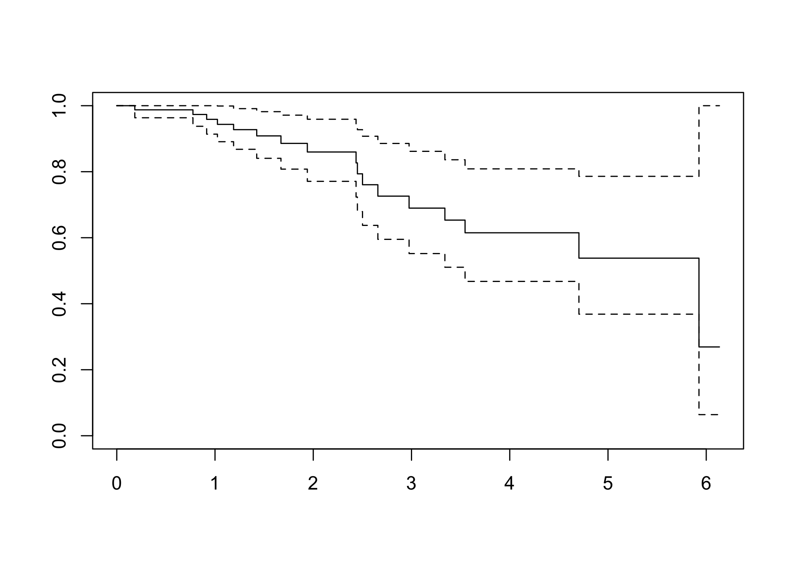

<!-- README.md is generated from README.Rmd. Please edit that file -->


# bigPLScox 

# bigPLScox, PLS models and their extension for big data in R
## Frédéric Bertrand and Myriam Maumy-Bertrand

<!-- badges: start -->
[](https://github.com/fbertran/bigPLScox/actions/workflows/R-CMD-check.yaml)
[](https://github.com/fbertran/bigPLScox/actions/workflows/rhub.yaml)
<!-- badges: end -->


`bigPLScox` provides Partial Least Squares (PLS) methods tailored for Cox
proportional hazards models with large, high-dimensional feature matrices. The
package works directly with [`bigmemory`](https://cran.r-project.org/package=bigmemory)
objects, enabling native C++ accelerators and iterative algorithms to run without loading the full dataset
into memory. In addition to the classical `coxgpls()` solver, the package
contains accelerated variants, cross-validation helpers, and model diagnostics.

- Generalised PLS Cox regression via `coxgpls()` with support for grouped predictors.
- Sparse and structured sparse extensions (`coxsgpls()`, `coxspls_sgpls()`).
- Deviance-residual estimators (`coxgplsDR()`, `coxsgplsDR()`) for robust fits.
- Cross-validation helpers (`cv.coxgpls()`, `cv.coxsgpls()`, …) to select the number of latent components.
- Dataset generators, and diagnostics such as `computeDR()` for quick residual exploration.
- High-performance deviance residuals via `computeDR(engine = "cpp")` for both in-memory and big-memory workflows.
- Sparse, group-sparse, and stochastic gradient variants able to consume
  file-backed `big.matrix` objects while leveraging `foreach` parallelism.
- Interfaces for big-memory data through `big_pls_cox()` and `big_pls_cox_gd()`.

GPU support is **not** available in the current release; ongoing development
focuses on improving the multi-core CPU back-end instead.

Additional articles are available in the `vignettes/` directory:

* *Getting started with bigPLScox* — a walkthrough of core modelling,
  cross-validation, and diagnostic helpers.
* *Overview of bigPLScox* — a tour of the main modelling functions with
  practical guidance on choosing estimators.
* *Big-memory workflows with bigPLScox* — guidance on using `bigmemory`
  matrices and parallel back-ends.
* *Benchmarking bigPLScox* — reproducible performance comparisons using the
  **bench** package.

Standalone benchmarking scripts that complement the vignette live under
`inst/benchmarks/`.

The documentation website and examples are maintained by Frédéric
Bertrand and Myriam Maumy.

> **Conference highlight.** Maumy, M. and Bertrand, F. (2023). 
*"PLS models and their extension for big data"*. Conference presentation at the 
Joint Statistical Meetings (JSM 2023), Toronto, Ontario, Canada, Aug 5–10, 2023.

> **Conference highlight.** Maumy, M. and Bertrand, F. (2023). 
*"bigPLS: Fitting and cross-validating PLS-based Cox models to censored big data"*. 
Poster at BioC2023: The Bioconductor Annual Conference, Dana-Farber Cancer Institute, 
Boston, MA, USA, Aug 2–4, 2023. doi:10.7490/f1000research.1119546.1.

## Key features

* **Scalable Cox-PLS solvers** (`coxgpls()`, `coxgplsDR()`) that operate on big
  matrices stored on disk.
* **Cross-validation tooling** to select the optimal number of PLS components
  with time-dependent performance metrics.
* **Model diagnostics** such as deviance residual visualisation through
  `computeDR()`.
* **Benchmark scripts** in `inst/benchmarks/` to quantify runtime trade-offs
  between the available solvers.
* **Comprehensive vignette** (`vignettes/bigPLScox.Rmd`) showing a complete
  modelling workflow.

## Installation

You can install the released version of bigPLScox from
[CRAN](https://CRAN.R-project.org) with:


``` r
install.packages("bigPLScox")
```

You can install the development version of bigPLScox from
[GitHub](https://github.com/fbertran/bigPLScox) with:


``` r
# install.packages("devtools")
devtools::install_github("fbertran/bigPLScox")
```

## Learning materials

* Browse the **Getting started** vignette with `vignette("getting-started",
  package = "bigPLScox")` for a worked example.
* Explore `vignette("bigPLScox", package = "bigPLScox")` for big-memory
  workflows and streaming solvers.
* Consult the function reference at <https://fbertran.github.io/bigPLScox/>.
* Run the benchmarking scripts in `inst/benchmarks/` to compare solver
  performance on simulated data.

## Release highlights

The full changelog lives in [`NEWS.md`](NEWS.md). Recent releases include:

- **0.6.0** — C++ deviance residuals with benchmarking helpers, prediction
  wrappers for `big_pls_cox()`/`big_pls_cox_gd()`, and new component selection
  utilities.
- **0.5.0** — pkgdown documentation refresh, reproducible benchmarking
  scripts, and expanded vignettes covering large-scale workflows.
  
# Quick start

The following example demonstrates the typical workflow on a subset of the
allelotyping dataset bundled with the package. Chunks are evaluated by default
when the README is rendered locally, but they can be toggled with
`knitr::opts_chunk$set(eval = FALSE)` for faster builds.


``` r
library(bigPLScox)
data(micro.censure)
data(Xmicro.censure_compl_imp)
Y_train <- micro.censure$survyear[1:80]
status_train <- micro.censure$DC[1:80]
X_train <- Xmicro.censure_compl_imp[1:80, ]
```


Fit a Cox-PLS model with six components and inspect the fit summary:

``` r
set.seed(123)
cox_pls_fit <- coxgpls(
  Xplan = X_train,
  time = Y_train,
  status = status_train,
  ncomp = 6,
  ind.block.x = c(3, 10, 20)
)
#> Error in colMeans(x, na.rm = TRUE): 'x' must be numeric
cox_pls_fit
#> Error: object 'cox_pls_fit' not found
```


Visualise deviance residuals to assess the baseline model fit and verify the
agreement between the R and C++ engines:

``` r
residuals_overview <- computeDR(Y_train, status_train, plot = TRUE)
```

<div class="figure">

<p class="caption">plot of chunk unnamed-chunk-5</p>
</div>

``` r
head(residuals_overview)
#>          1          2          3          4          5          6 
#> -1.4843296 -0.5469540 -0.2314550 -0.3400301 -0.9763372 -0.3866766

cpp_residuals <- computeDR(
  Y_train,
  status_train,
  engine = "cpp",
  eta = predict(cox_pls_fit, type = "lp")
)
#> Error: object 'cox_pls_fit' not found
stopifnot(all.equal(residuals_overview, cpp_residuals, tolerance = 1e-7))
#> Error: object 'cpp_residuals' not found
```

Cross-validate the number of components and re-fit using the deviance residual
solver for comparison:

``` r
set.seed(123)
cv_results <- cv.coxgpls(
  list(x = X_train, time = Y_train, status = status_train),
  nt = 6,
  ind.block.x = c(3, 10, 20)
)
#> Error in colMeans(x, na.rm = TRUE): 'x' must be numeric
cv_results$opt_nt
#> Error: object 'cv_results' not found
cox_pls_dr <- coxgplsDR(
  Xplan = X_train,
  time = Y_train,
  status = status_train,
  ncomp = cv_results$opt_nt,
  ind.block.x = c(3, 10, 20)
)
#> Error in colMeans(x, na.rm = TRUE): 'x' must be numeric
cox_pls_dr
#> Error: object 'cox_pls_dr' not found
```

Explore alternative estimators such as `coxgplsDR()` for deviance-residual fitting or `coxsgpls()` for sparse component selection. Refer to the package reference for the full list of available models and helper functions.

## Benchmarking

We provide reproducible benchmarks that compare `coxgpls()` and the big-memory
solvers against `survival::coxph()`. Start with the **Benchmarking bigPLScox**
vignette for an interactive tour.

For command-line experiments, execute the scripts in `inst/benchmarks/` after
installing the optional dependencies listed under `Suggests` in the
`DESCRIPTION` file. Each script accepts environment variables (for example,
`bigPLScox.benchmark.n`, `bigPLScox.benchmark.p`, and
`bigPLScox.benchmark.ncomp`) to control the simulation size.

```bash
Rscript inst/benchmarks/cox-benchmark.R
Rscript inst/benchmarks/cox_pls_benchmark.R
Rscript inst/benchmarks/benchmark_bigPLScox.R
```

Results are stored under `inst/benchmarks/results/` with time-stamped filenames
for traceability.

## Vignettes and documentation

Four vignettes ship with the package:

1. **Getting started with bigPLScox** – an end-to-end introduction covering data
   preparation, fitting, and validation workflows.
2. **Overview of bigPLScox** – a high-level description of the modelling
   functions and their typical use cases.
3. **Big-memory workflows with bigPLScox** – instructions for working with
   `bigmemory` matrices and the streaming solvers.
4. **Benchmarking bigPLScox** – guidance for evaluating performance against
   baseline Cox implementations using the **bench** package.
   
The full reference documentation and pkgdown website are available at
<https://fbertran.github.io/bigPLScox/>.

## Bug reports and feature requests

Bug reports and feature requests can be
filed on the [issue tracker](https://github.com/fbertran/bigPLScox/issues/). Please make
sure that new code comes with unit tests or reproducible examples when applicable.
